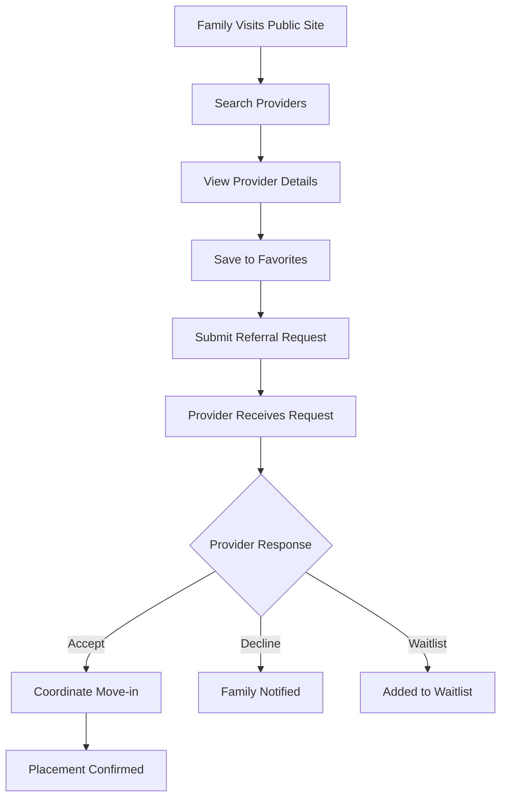
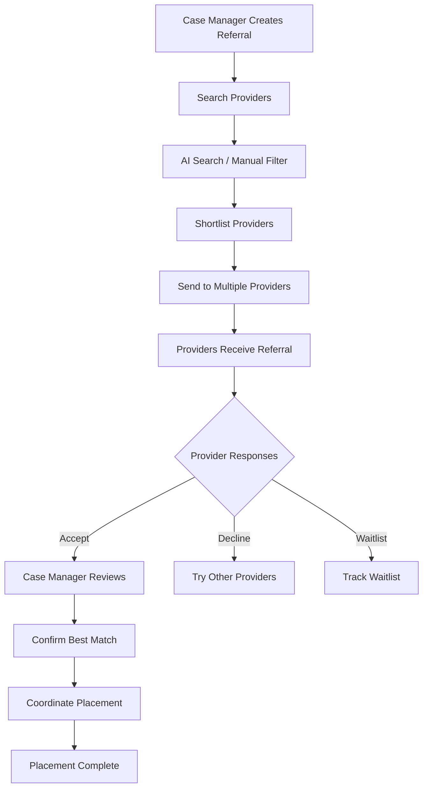
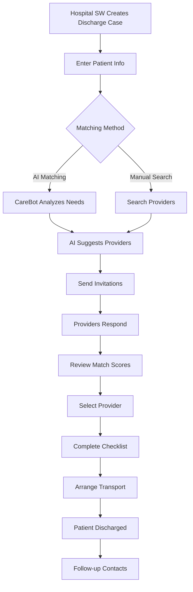
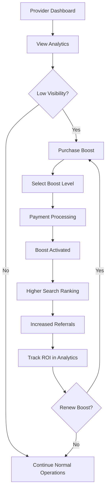
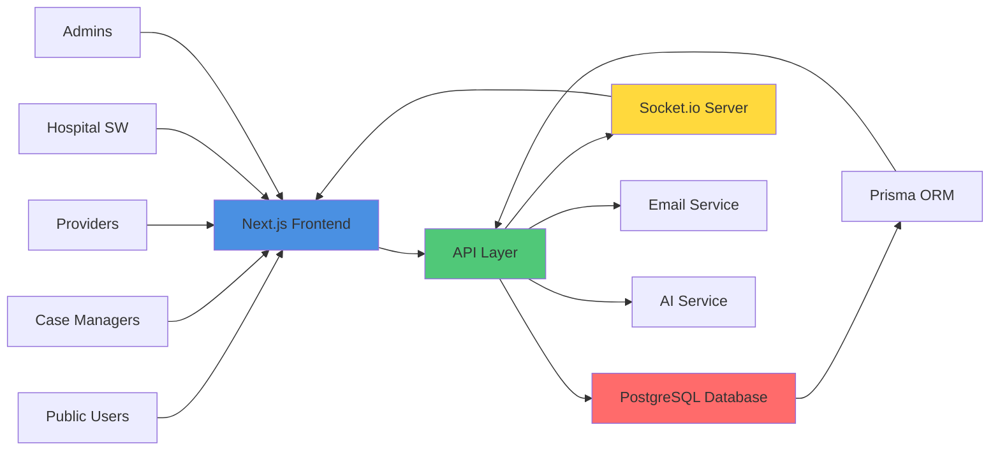

# CareLink MN Platform Documentation

## Platform Overview

CareLink MN is a comprehensive healthcare placement platform connecting families, case managers, hospitals, and care providers to streamline the placement process for vulnerable populations requiring residential care.

---

## User Roles & Features

### 1. 👨‍👩‍👧‍👦 Public/Family Role

**Purpose**: Families and individuals searching for care facilities for their loved ones.

**Key Features**:
- **Provider Search**: Advanced filtering by location, care level, payer type, and amenities
- **AI-Powered Search**: "CareBot" natural language search (e.g., "Find memory care near Minneapolis accepting MA")
- **Favorites**: Save and compare providers
- **Referral Requests**: Submit placement requests directly to providers
- **Real-time Availability**: View current openings and capacity

**Dashboard Access**: Public search interface (no login required for browsing)

---

### 2. 🏥 Case Manager Role

**Purpose**: County or agency case managers coordinating placements for clients.

**Key Features**:
- **Referral Management**:
  - Create, track, and manage client referrals
  - Kanban and List views for workflow management
  - Export referrals (CSV/PDF)
  - Bulk actions (shortlist, message multiple providers)
- **Provider Search**:
  - Advanced filtering with AI search integration
  - Shortlist management
  - Provider comparison tools
- **Communication**:
  - Integrated messaging with providers
  - Batch messaging to multiple providers
- **Dashboard**:
  - Quick stats (Total, Active, Pending referrals)
  - Urgent cases alerts
  - Recent activity feed
  - Response rate tracking

**Workflow**: Create Referral → Search Providers → Shortlist → Send to Providers → Track Responses → Confirm Placement

---

### 3. 🏠 Provider (VRS) Role

**Purpose**: Care facilities and residential service providers managing their listings and responding to referrals.

**Key Features**:
- **Referral Management**:
  - View inbound referrals
  - Accept, Decline, or Waitlist referrals
  - Filter by status, urgency, payer
  - Export referrals (CSV)
- **Availability Management**:
  - Create and manage openings
  - Track capacity and current occupancy
  - "Stale" opening detection (auto-alerts)
- **Analytics** (Pro Feature):
  - Conversion funnel (Views → Inquiries → Placements)
  - Payer mix analysis
  - Response time metrics
  - Export to CSV/Excel/PDF
- **Boost System**:
  - Purchase placement boosts for higher visibility
  - Tiered boost levels (Bronze, Silver, Gold, Platinum)
  - Boost expiration tracking
- **Licensing & Compliance**:
  - License tracking with expiration alerts
  - Document management

**Workflow**: Receive Referral → Review Client Needs → Accept/Decline → Coordinate Placement → Confirm Move-in

---

### 4. 🏥 Hospital Social Worker Role

**Purpose**: Hospital discharge planners coordinating patient transitions to residential care.

**Key Features**:
- **Discharge Case Management**:
  - Comprehensive intake form (demographics, medical needs, preferences)
  - List and detail views for all discharge cases
  - Status tracking (Intake → Matching → Placement → Discharged)
- **Provider Matching**:
  - **AI Matching**: "CareBot" analyzes patient needs and suggests best-fit providers with explanations
  - **Manual Search**: Search providers by name/location
- **Invitation System**:
  - Send bulk invitations to providers
  - Track invitation expiry (24h/48h)
  - View provider responses in real-time
  - Match score indicators
- **Workflow Tools**:
  - **Checklists**: Pre-Discharge, During-Discharge, Post-Discharge tracking
  - **NEMT Booking**: Integrated non-emergency medical transport
  - **Consent Tracking**: Digital consent management

**Workflow**: Create Discharge Case → AI Matching → Send Invitations → Review Responses → Confirm Placement → Track Checklist → Follow-up

---

### 5. ⚙️ Admin Role

**Purpose**: System administrators managing the entire platform.

**Key Features**:
- **User Management**:
  - CRUD operations for all users
  - Role assignment and permissions
  - Status management (Active, Suspended, Deactivated)
  - Filter by role and status
- **Organization Management**:
  - CRUD operations for all organizations
  - Verification workflow
  - Type filtering (Provider, Hospital, VRS, etc.)
  - Status management
- **Compliance Monitoring**:
  - Track compliance issues with severity levels
  - Filter by severity (Critical, High, Medium, Low)
  - Issue resolution workflow
- **Platform Analytics**:
  - User and organization growth metrics
  - Daily/Monthly active users
  - Total referrals and placements
  - Date range filtering
- **Audit Logs**:
  - Comprehensive activity logging
  - Filter by action type, resource, and date
  - Export capability for compliance

**Workflow**: Monitor Dashboard → Review Pending Items → Verify Organizations/Licenses → Resolve Compliance Issues → Generate Reports

---

## System Workflows

### Workflow 1: Family-Initiated Placement

### Workflow 2: Case Manager Referral Process

### Workflow 3: Hospital Discharge Planning

### Workflow 4: Provider Boost System

---

## Key System Features

### 🤖 AI-Powered Matching ("CareBot")

**Available to**: Case Managers, Hospital Social Workers

**How it works**:
1. User creates a referral/discharge case with client needs
2. CareBot analyzes:
   - Medical needs (diagnosis codes, mobility, cognitive status)
   - Geographic preferences
   - Payer requirements
   - Special needs (DME, behavioral concerns)
3. AI returns ranked providers with:
   - Match score (0-100%)
   - Match reasons (e.g., "Accepts MA-EPD", "Wheelchair accessible")
   - Explanation of why each provider was selected

### 🔔 Real-time Notifications

**System-wide feature** using Socket.io:
- Instant alerts for new referrals
- Provider response notifications
- License expiration warnings
- Compliance issue alerts
- Placement confirmations

### 📊 Subscription Tiers

**Provider Plans**:
- **Free**: Basic listing, limited referrals
- **Pro**: Analytics, unlimited referrals, priority support
- **Premium**: All Pro features + advanced analytics + dedicated account manager

### 🚀 Boost System

**Provider visibility enhancement**:
- **Bronze**: 2x visibility (7 days) - $99
- **Silver**: 3x visibility (14 days) - $199
- **Gold**: 5x visibility (30 days) - $399
- **Platinum**: 10x visibility (60 days) - $799

---

## Data Flow Architecture

---

## Security & Compliance

### Role-Based Access Control (RBAC)

Each role has specific capabilities:
- **Public**: Search and request only
- **Case Manager**: Referral management, provider search
- **Provider**: Referral responses, availability management
- **Hospital SW**: Discharge planning, AI matching
- **Admin**: Full system access, user/org management

### Audit Logging

All critical actions are logged:
- User authentication
- Referral creation/updates
- Provider responses
- License verifications
- Compliance actions

### Data Privacy

- **HIPAA Compliance**: Minimal PHI (patient initials only)
- **Encrypted Communications**: All data in transit encrypted
- **Audit Trails**: Complete activity tracking
- **Access Controls**: Strict permission-based access

---

## Getting Started Guide

### For Families
1. Visit the public search page
2. Use filters or AI search to find providers
3. Save favorites for comparison
4. Submit referral requests to preferred providers
5. Wait for provider responses

### For Case Managers
1. Log in to Case Manager dashboard
2. Create a new referral with client details
3. Use AI search or manual filters to find providers
4. Shortlist and send to multiple providers
5. Track responses in Kanban view
6. Confirm placement with best match

### For Providers
1. Log in to Provider dashboard
2. Review inbound referrals
3. Accept, decline, or waitlist based on capacity
4. Update availability/openings regularly
5. Use analytics to track performance
6. Consider boost for increased visibility

### For Hospital Social Workers
1. Log in to Hospital SW dashboard
2. Create discharge case with patient info
3. Use AI matching for provider suggestions
4. Send invitations to matched providers
5. Review responses and match scores
6. Complete discharge checklist
7. Arrange transport and follow-up

### For Admins
1. Log in to Admin dashboard
2. Monitor pending verifications
3. Review and approve organizations/licenses
4. Track compliance issues
5. Generate platform analytics
6. Review audit logs for security

---

## Support & Resources

- **Technical Support**: support@carelinkMN.com
- **Provider Onboarding**: onboarding@carelinkMN.com
- **Compliance Questions**: compliance@carelinkMN.com

---

*This documentation is current as of November 2024. For the latest updates, please refer to the internal wiki or contact the development team.*
